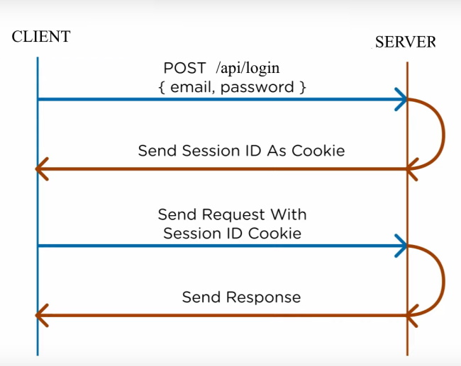

# CookieAuthentication
A simple cookie based authentication example using Asp.net core. The drawback of cookie based authentication is that, every Cleint session will be saved in the server memory. Therefore, if you are planning to design a stateless architecture or run your API in multiple virutal machines behind a load balancer with no session persistancy, your rest API will not work since client requests will be distrbuted randomly to those virtual machines. Thereby, your API request with a given cookie may not be served by the same virtual machine. In case you want a stateless implementation then always use JWT based authentication (please find the repo https://github.com/mail4hafij/JWTAuthentication).

How to run locally: After you build and run the project, use Postman (or other similar tools you are familier with) to make a login POST request to https://localhost:44322/api/Login. You should then get back a cookie value which will be used to send your api GET request to https://localhost:44322/api/status.

Please do all the neccessary changes as you see it fit (i.e., email, password authentication with your database in SignInManager class).

